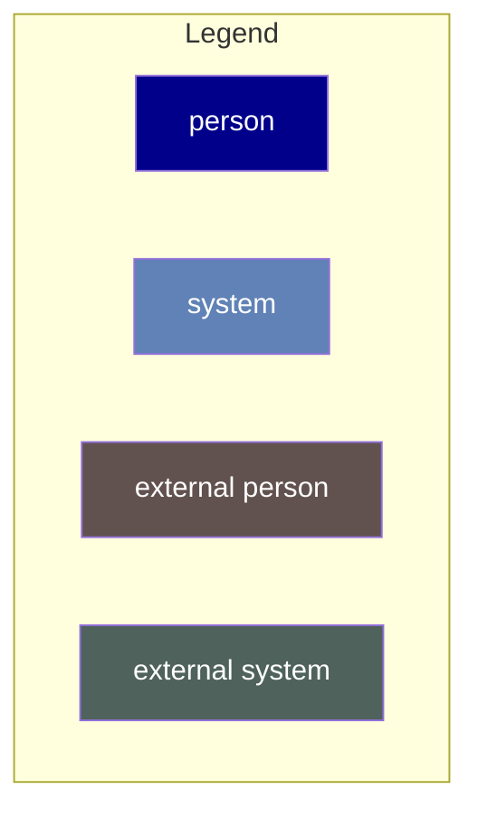
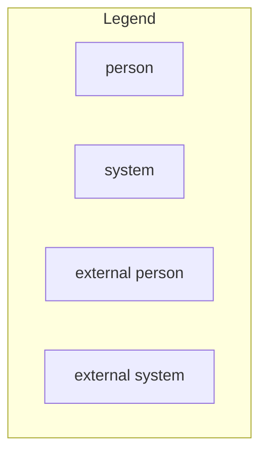

```mermaid
flowchart TB
classDef borderless stroke-width:0px
classDef darkBlue fill:#00008B, color:#fff
classDef brightBlue fill:#6082B6, color:#fff
classDef gray fill:#62524F, color:#fff
classDef gray2 fill:#4F625B, color:#fff

subgraph Legend[Legend]
    Legend1[person]
    Legend2[system]
    Legend3[external person]
    Legend4[external system]
end
class Legend1 darkBlue
class Legend2 brightBlue
class Legend3 gray
class Legend4 gray2
```

```mermaid
flowchart TB


subgraph Legend[Legend]
    Legend1[person]
    Legend2[system]
    Legend3[external person]
    Legend4[external system]
end
class Legend1 darkBlue
class Legend2 brightBlue
class Legend3 gray
class Legend4 gray2
```

```mermaid
flowchart TB
subgraph Legend[Legend]
    Legend1[person]
    Legend2[system]
    Legend3[external person]
    Legend4[external system]
end
```